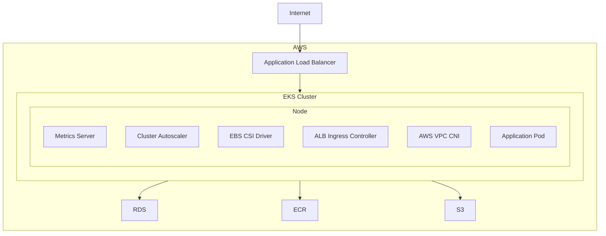

# EKS Architecture example

## Diagram Overview

### Application Load Balancer (ALB)

- **Application Load Balancer (ALB)**: The ALB serves as the entry point for traffic from the internet. It distributes incoming application traffic across multiple targets in the EKS cluster, ensuring high availability and reliability.

### Amazon Elastic Kubernetes Service (EKS)

- **EKS Cluster**: This is the managed Kubernetes service provided by AWS. It hosts the application and its related services, ensuring scalability and ease of management.

#### Node Components within EKS Cluster

Within the EKS cluster, each node hosts several critical components:

1. **Metrics Server**: Collects resource usage data (CPU, memory) from the nodes and pods in the cluster, enabling monitoring and scaling decisions.
2. **Cluster Autoscaler**: Automatically adjusts the number of nodes in the cluster based on the pod demands, ensuring efficient resource utilization and cost management.
3. **EBS CSI Driver**: Manages the Amazon Elastic Block Store (EBS) volumes within the Kubernetes cluster, providing persistent storage for the applications.
4. **ALB Ingress Controller**: Manages the ALB configuration to route traffic to Kubernetes services based on Ingress resources. It automatically creates listeners and target groups starting from directives in the Ingress object.
5. **AWS VPC CNI**: Provides native VPC networking for the EKS cluster, enabling secure and scalable networking.
6. **Application Pod**: This represents the application workloads running within the EKS cluster.